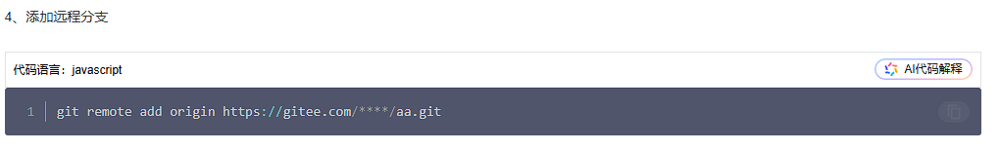
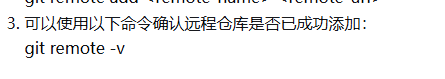
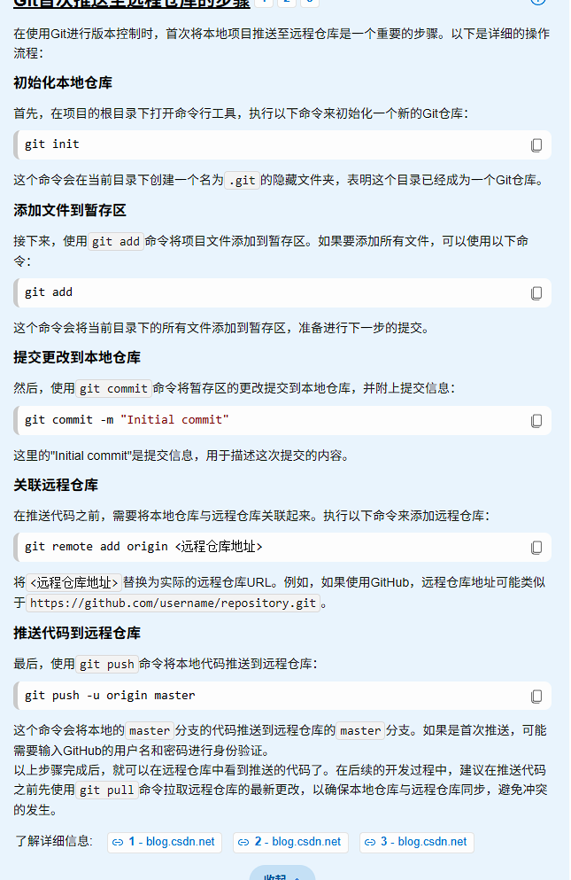
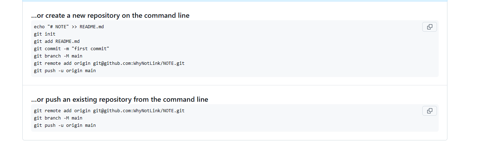

### 绑定

git config --global user.name "Your Name"
git config --global user.email "your.email@example.com"

### 添加分支



### 查看分支



### 相关指令



​					origin是向关联ssh发送的地址名称

​					cat ~/.ssh/id_rsa.pub 显示rsa内容


### 创建密钥

```
ssh-keygen -t rsa -b 4096 -C "你的邮箱@xxx.com"
```

然后去文件夹.ssh找


## esc :wq退出vim编辑 并且保存退出

### git branch -r查找所有分支


### git教程


