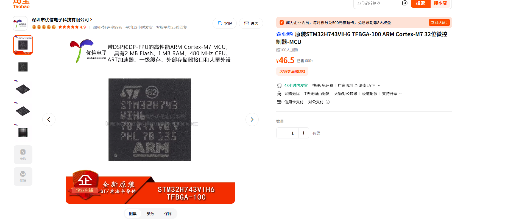
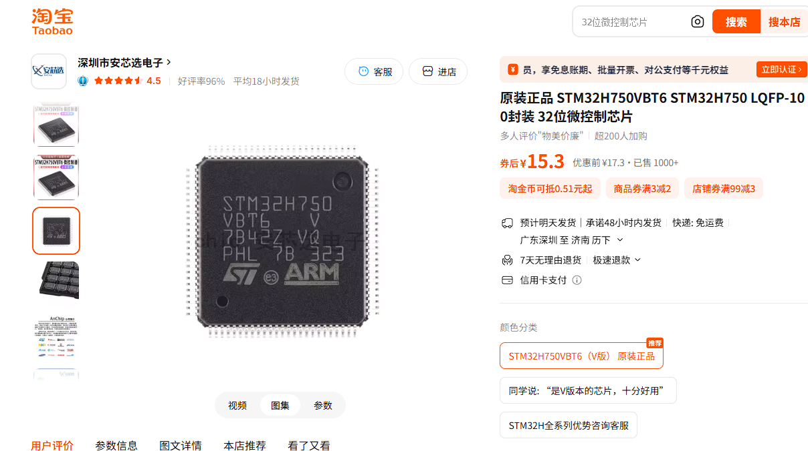
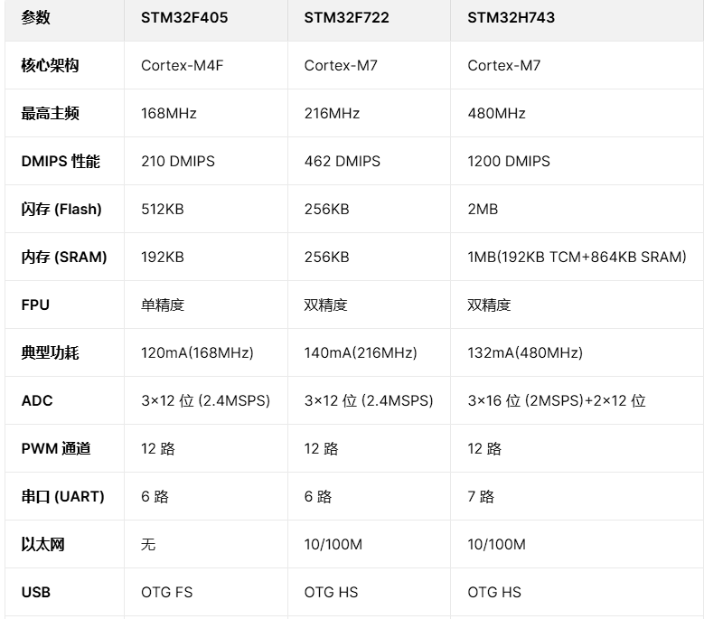
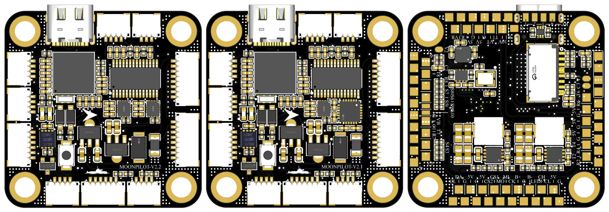
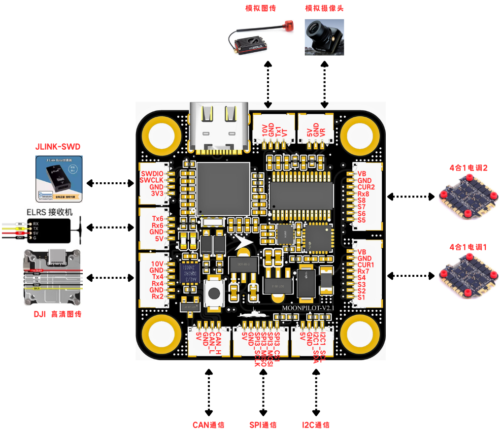

# 飞控芯片

## H743VIT6

## H743VIH6

## H750VBT6

## F405,F722,H743

# 飞控固件

| 固件名称           | 核心定位          | 实时操作系统 | 控制频率 | 典型应用场景                | 开源协议 |
| ------------------ | ----------------- | ------------ | -------- | --------------------------- | -------- |
| **ArduPilot(APM)** | 全功能专业飞控    | ChibiOS      | 200Hz    | 植保、巡检、测绘、固定翼    | GPLv3    |
| **PX4**            | 学术 / 工业级飞控 | NuttX        | 400Hz    | 自主飞行、AI 融合、多传感器 | BSD      |
| **Betaflight(BF)** | 穿越机竞速 / 花飞 | 裸机调度     | 32kHz    | 竞速穿越机、FPV 花飞        | GPLv3    |
| **INAV**           | 导航增强型穿越机  | 裸机调度     | 4kHz     | 远航穿越机、固定翼、多旋翼  | GPLv3    |

| 芯片型号      | ArduPilot                   | PX4                      | Betaflight | INAV       | Rotorflight | 备注                           |
| ------------- | --------------------------- | ------------------------ | ---------- | ---------- | ----------- | ------------------------------ |
| **STM32F405** | ✅ 官方支持(部分功能阉割)    | ✅ 官方支持(功能受限)     | ✅ 完美支持 | ✅ 完美支持 | ✅ 支持      | Flash 512KB 限制复杂算法       |
| **STM32F722** | ⚠️ 官方支持(AP 固件功能受限) | ⚠️ 官方支持(部分功能阉割) | ✅ 完美支持 | ✅ 完美支持 | ✅ 支持      | Flash 256KB 是主要瓶颈         |
| **STM32H743** | ✅ 官方支持(完整版)          | ✅ 官方支持(完整版)       | ✅ 完美支持 | ✅ 完美支持 | ✅ 支持      | 2MB Flash+1MB SRAM，无功能限制 |

# 飞控板料

## BEC

无人机的动力系统（电机）使用高电压锂电池（如 3S=11.1V、4S=14.8V、6S=22.2V）供电，但飞控、接收机、舵机、传感器等低压设备，仅需 **5V 或 3.3V** 稳定电压。

BEC 的核心功能是：**将动力电池的高压直流电，降压转换为低压直流电，为飞控等低压设备供电**，从而省去为低压设备单独配置电池的步骤

## Baro

Baro（气压计）：I2C/SPI 连接，测量高度，典型型号 BMP280/DPS310

## Magnetometer

I2C 连接，提供方向信息，配合 GPS 实现精准定位

# PCB图

# 简介

- 使用 STM32H743VIH6 单片机，主频可高达480MHz，除BETAFLIGHT外，对部署了RTOS的飞控系统更加友好，也可部署验证您自己的导航/控制算法；
- 正面布局10个SH1.0插口和1个USB接口，满足了穿越机起飞的基本需求，使用者无须具备一定的焊接技能即可将飞机放飞，额外设计了SWD端口，满足调试需求；
- 双LDO供电设计，MCU供电与SENSORS供电分离，为各传感器提供更加纯净的电源输入；
- 两种PCB设计，不同的IMU组合，ICM42688P × 2（V2.2） 或者 ICM42688P + ICM20689（V2.1）；
- 传感器配置丰富（IMU × 2 + 气压计× 1 + 磁力计× 1）；
- 配备USB防反击电路、TVS二极管、自恢复保险丝，增加飞控使用安全性；
- 双BEC（5V-2A，10V-1.5A）；
- 最小0402封装，降低复刻和维修难度；
- 硬件缩短模拟摄像头输入线路和AT7456E模拟输出线路，尽可能保证模拟信号质量。

# 功能

- **IMU** × 2（ICM42688P × 2 or ICM42688P × 1 + ICM20689 × 1）；
- **BARO** × 1（DPS310 or SPL06）；
- **MAG** × 1（IST8310）；
- **SD卡** × 1；
- **UART** × 7（UART1/2/3/4/6/7/8）；
- **PWM/DSHOT** × 10（1-8有接插件，9-10仅焊盘）；
- **CAN** × 1；
- **SPI** × 1（带2个CS引脚）；
- **I2C** × 1；
- **LED** × 1；
- **BEEPER** × 1；
- **PIN_IO** × 4；
- **SWD-DEBUG** × 1；
- **CAM** × 1；
- **OSD** × 1；
- **ADC** × 5（10k:1k × 1，20k:1k × 1，10k:10k × 1，1:1 × 2）；
- **BEC** 5V-2A，10V（实际输出10.4V）-1.5A；

# 传感器

| 器件名称            | 器件类型            | 核心功能                                               | 连接总线            | 飞控中作用                                     | 备注                             |
| ------------------- | ------------------- | ------------------------------------------------------ | ------------------- | ---------------------------------------------- | -------------------------------- |
| ICM42688-P（U2/U3） | 惯性测量单元（IMU） | 集成 3 轴陀螺仪（测角速度）+3 轴加速度计（测线加速度） | SPI                 | 作为姿态解算的核心数据来源，支撑无人机稳定悬停 | 双份设计（冗余），提升故障容错率 |
| IST8310（U4）       | 3 轴磁力计（罗盘）  | 测量地球磁场，输出地磁航向角                           | I2C3                | 确定无人机飞行方向，辅助 GPS 定点 / 返航       | -                                |
| DPS310（U6）        | 高精度气压计        | 测量大气压力，计算相对高度                             | I2C2                | 实现 “定高模式”，辅助 GPS 校准海拔高度         | -                                |
| AT7456E（U5）       | 视频叠加器（OSD）   | 接收图传视频信号，叠加飞控数据（电压 / 高度等）        | 视频信号 + 控制总线 | 在 FPV 画面中显示飞控实时参数，辅助飞行员操作  | 非传感器，属于显示模块           |

| 模块区域            | 核心器件                                                     | 器件类型                                    | 核心功能                                         | 飞控中作用                                      | 备注                                 |
| ------------------- | ------------------------------------------------------------ | ------------------------------------------- | ------------------------------------------------ | ----------------------------------------------- | ------------------------------------ |
| MP9943GQ-Z BEC-5V   | MP9943GQ-Z（U7）                                             | 开关型降压转换器（BEC）                     | 将 VBAT（电池电压）转换为稳定 5V 输出            | 给 MCU、接收机、部分外设供电                    | 开关型效率高（85%+），适合大电流场景 |
| MP9943GQ-Z BEC-10V  | MP9943GQ-Z（U8）                                             | 开关型降压转换器（BEC）                     | 将 VBAT 转换为稳定 10V 输出                      | 给 DJI 图传、模拟图传等高压外设供电             | 同属开关型 BEC，适配高压设备         |
| ASM1117-3.3V-MCU    | ASM1117-3.3（U9）                                            | 线性稳压器                                  | 将 5V 转换为 3.3V 输出                           | 给 MCU 的数字 / 模拟电路供电                    | 单独供电，减少 MCU 干扰              |
| ASM1117-3.3V-SENSOR | ASM1117-3.3（U10）                                           | 线性稳压器                                  | 将 5V 转换为 3.3V 输出                           | 给 IMU、磁力计、气压计等传感器供电              | 与 MCU 电源隔离，保障传感器精度      |
| VCC NET（电源保护） | SMAJ30CA（TVS）、JK-SMD050-30（保险丝）、SS14W（肖特基二极管） | 电源保护器件（TVS + 保险丝 + 防反接二极管） | 抑制浪涌 / 静电、防止过流、防止电池反接          | 保护飞控核心电路，避免电池插拔 / 故障时损坏器件 | 多维度电源防护                       |
| ADC-VBAT1/ADC-VBAT2 | 电阻分压电路 + 电容                                          | 电压检测电路                                | 采集 VBAT 电压（通过分压适配 MCU ADC 量程）      | 实现低电压报警、剩余电量计算                    | 双路检测，提升数据可靠性             |
| ADC-AIRS            | 电阻分压电路 + 电容                                          | 电压检测电路                                | 采集 Airs 相关电压（如接收机信号强度、外设电压） | 辅助监测外设工作状态                            | 扩展电压检测通道                     |

| 模块区域      | 核心器件                               | 器件类型                | 核心功能                                                    | 飞控中作用                                             | 备注                                     |
| ------------- | -------------------------------------- | ----------------------- | ----------------------------------------------------------- | ------------------------------------------------------ | ---------------------------------------- |
| USB_OTG       | USBLC6-2P（U6）、GTUSB-7010ASV（插座） | USB 接口 + ESD 保护芯片 | 提供 USB 通信通道，同时抑制静电 / 浪涌                      | 飞控调参、固件升级、日志下载                           | 兼容 Micro USB 接口                      |
| DEBUG         | ZX-SH1H-4PWT（U12）                    | SWD 调试接口座          | 引出 MCU 的 SWDIO/SWCLK 等调试引脚                          | 固件烧录、程序调试（开发 / 故障排查用）                | 仅开发阶段使用                           |
| DJI O3        | ZX-SH1H-6PWT（U11）                    | DJI 图传专用接口座      | 连接 DJI O3 高清图传模块                                    | 传输高清 FPV 视频 + 飞控数据                           | 适配 DJI 数字图传系统                    |
| CAMERA        | ZX-SH1H-3PWT（U14）                    | FPV 相机接口座          | 连接模拟 / 数字 FPV 相机                                    | 接收相机视频信号，传递给图传模块                       | 支持 5V 相机供电                         |
| VTX           | ZX-SH1H-4PWT（U13）                    | 图传发射端接口座        | 连接图传发射模块                                            | 输出视频信号到 FPV 眼镜 / 显示器                       | 支持 10V 高压供电（适配大功率图传）      |
| I2C1          | ZX-SH1H-4PWT（U18）                    | I2C 扩展接口座          | 引出 I2C 总线引脚（SDA/SCL）                                | 外接 I2C 设备（如 OLED 屏、额外传感器）                | 带 3.3V 供电和上拉电阻                   |
| SBUS & PPM    | ZX-SH1H-4PWT（U15）                    | 接收机信号接口座        | 接收遥控器的 SBUS/PPM 信号                                  | 传递飞行员的操控指令（控制无人机飞行）                 | 兼容主流遥控器接收机                     |
| ESC           | ZX-SH1H-8PWT（U17/U16）                | 电调接口座（双 8 通道） | 连接 4 合 1 电调，引出电机信号 + 电流 / 电压检测引脚        | 输出电机控制信号（DShot/PWM），同时采集电调电流 / 电压 | 支持 8 轴无人机（双 4 合 1 电调）        |
| MICRO SD CARD | AU62（U19）+ TF 卡座                   | 存储卡接口电路          | 连接 Micro SD 卡                                            | 存储飞行日志、黑盒数据（用于飞行分析 / 故障排查）      | 支持大容量 SD 卡                         |
| CAN           | TJA1051（U20）+ ZX-SH1H-4PWT（U21）    | CAN 总线收发器 + 接口座 | 实现 CAN 总线通信（差分信号）                               | 连接 UAVCAN 协议设备（如智能电调、电源模块）           | 工业级设备互联常用总线                   |
| SPI3          | ZX-SH1H-6PWT（U22）+ 电阻 R60/R61      | SPI 扩展接口座          | 引出 SPI3 总线引脚（SCK/MISO/MOSI/CS），并提供 3.3V/5V 供电 | 外接 SPI 协议设备（如额外传感器、高速存储芯片）        | 带电源引脚，方便外设直接取电             |
| BEEPER        | SS8050（Q1，NPN 三极管）+ 电阻 R69     | 蜂鸣器驱动电路          | 通过三极管放大 MCU 的控制信号，驱动蜂鸣器发声               | 飞控状态提示（如低电压报警、失控提示、启动成功反馈）   | MCU 引脚电流较小，三极管用于放大驱动电流 |
